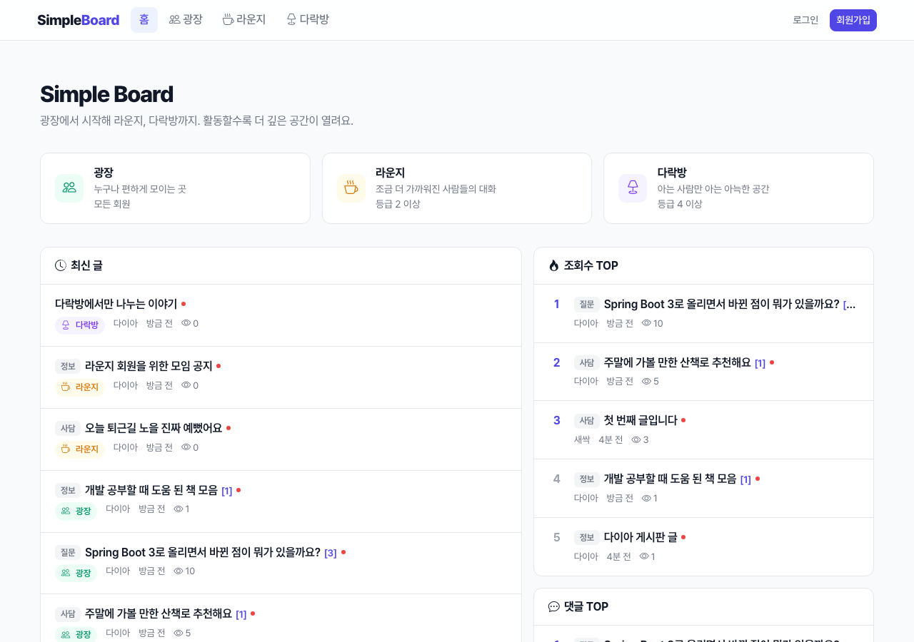
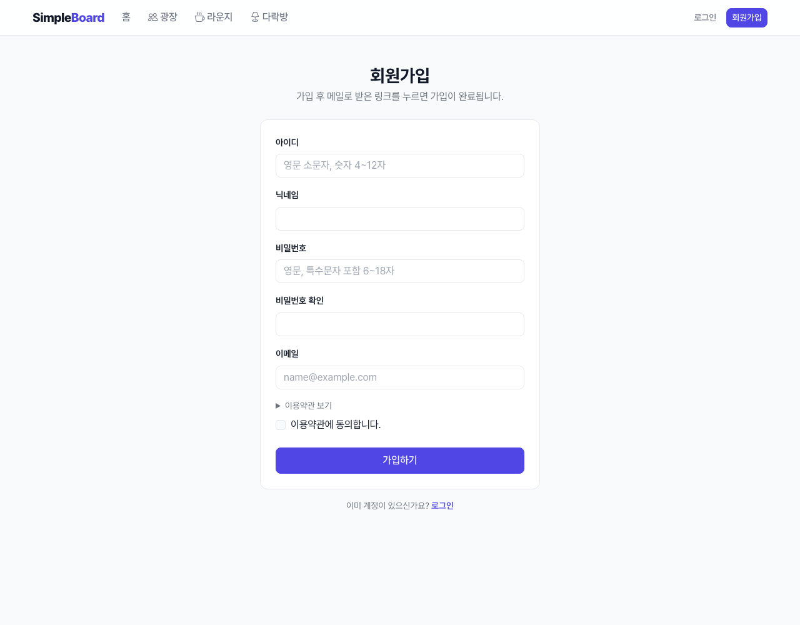
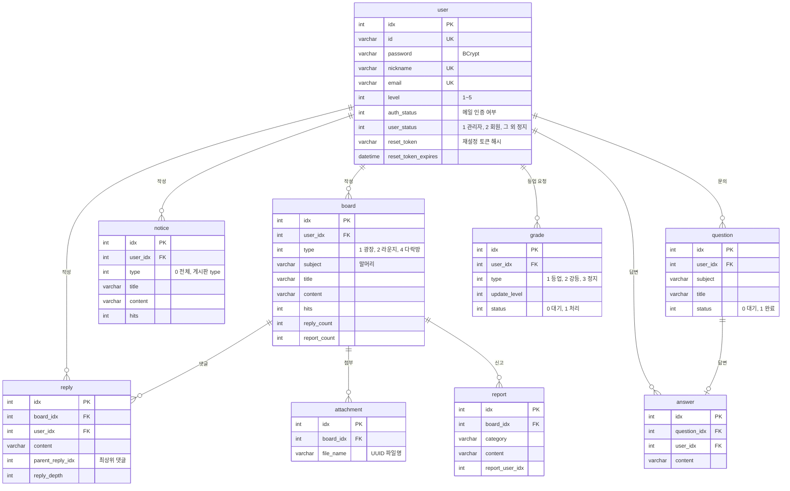

# Simple Board

활동할수록 더 깊은 공간이 열리는 **등급제 커뮤니티 게시판**입니다.
누구나 들어올 수 있는 **광장**에서 시작해, 글과 댓글로 등급을 올리면 **라운지**와 **다락방**이 열립니다.

개인 프로젝트로 시작해 Spring 4 + JSP로 만들었고, 이후 **Spring Boot 3 + Thymeleaf**로 옮기면서 보안과 구조를 다시 정리했습니다.



## 목차
- [주요 기능](#주요-기능)
- [게시판과 등급](#게시판과-등급)
- [기술 스택](#기술-스택)
- [시작하기](#시작하기)
- [프로젝트 구조](#프로젝트-구조)
- [데이터베이스](#데이터베이스)
- [URL 목록](#url-목록)
- [보안](#보안)
- [변경 이력](#변경-이력)
- [앞으로 할 일](#앞으로-할-일)

## 주요 기능

### 회원
- **회원가입:** 아이디·닉네임·이메일 중복을 입력하는 즉시 확인하고, 가입하면 **인증 메일**을 보냅니다. 메일의 링크를 눌러야 가입이 완료됩니다.
- **로그인 / 로그아웃:** 메일 인증 전 계정과 정지된 계정은 로그인할 수 없습니다.
- **아이디 찾기:** 가입한 이메일로 아이디를 보냅니다.
- **비밀번호 찾기:** 아이디와 이메일이 일치하면 **재설정 링크**를 메일로 보냅니다. 링크는 30분 동안 한 번만 쓸 수 있습니다.
- **내 정보:** 닉네임 변경, 비밀번호 변경(현재 비밀번호 확인 필요), 회원 탈퇴



### 게시판
- 등급별 게시판 3개: 광장 / 라운지 / 다락방 ([게시판과 등급](#게시판과-등급) 참고)
- **목록:** 페이지당 15개. 공지를 위에 고정하고, 오늘 쓴 글에는 새 글 표시를 붙입니다.
- **검색:** 제목, 내용, 작성자로 검색합니다.
- **글쓰기·수정:** 말머리(사담/질문/정보)를 고를 수 있고, 이미지는 최대 5개까지 첨부할 수 있습니다.
- **삭제:** 작성자 본인 또는 관리자만 할 수 있습니다.
- **신고:** 사유 7가지 중 하나를 고르거나 직접 입력합니다. 본인 글은 신고할 수 없고, 같은 글은 한 번만 신고할 수 있습니다.

### 댓글
- 댓글과 대댓글을 작성할 수 있고, 페이지당 10개씩 보여줍니다.
- 등록, 수정, 삭제가 페이지 새로고침 없이 바로 반영됩니다.

### 내 활동
- 내 글, 내 댓글, 내 문의를 탭으로 모아 보고, 여러 개를 골라 한 번에 삭제할 수 있습니다.

### 문의
- 관리자에게 문의를 남기고 답변을 받습니다. 문의글은 작성자 본인과 관리자만 볼 수 있습니다.

### 관리자
- **공지:** 전체 공지나 게시판별 공지를 작성·수정·삭제합니다.
- **신고:** 신고가 10건 이상 쌓인 글과 사유별 건수를 확인합니다.
- **문의:** 답변을 작성하고 완료 처리합니다.
- **등업 승인:** 등업 대상은 [자동으로 집계](#게시판과-등급)됩니다.

## 게시판과 등급

| 게시판 | URL | 입장 등급 | 소개 |
| --- | --- | --- | --- |
| 광장 | `/boards/plaza` | 모든 회원 | 누구나 편하게 모이는 곳 |
| 라운지 | `/boards/lounge` | 등급 2 이상 | 조금 더 가까워진 사람들의 대화 |
| 다락방 | `/boards/attic` | 등급 4 이상 | 아는 사람만 아는 아늑한 공간 |

회원 등급은 5단계입니다: 준회원1 → 준회원2 → 정회원 → 우수회원 → 특별회원.
매주 수요일 자정에 스케줄러가 아래 조건을 채운 회원을 등업 대상으로 모으고, 관리자가 승인하면 등급이 한 단계 오릅니다.

| 등업 | 가입 일수 | 작성 글 | 작성 댓글 |
| --- | --- | --- | --- |
| 준회원1 → 준회원2 | 14일 | 3개 | 10개 |
| 준회원2 → 정회원 | 30일 | 10개 | 30개 |
| 정회원 → 우수회원 | 90일 | 25개 | 50개 |
| 우수회원 → 특별회원 | 180일 | 50개 | 100개 |

게시판의 이름·설명·아이콘은 `BoardType.java`에서, 등업 조건은 `GradeRule.java`에서 바꿀 수 있습니다.

## 기술 스택

| 구분 | 사용 기술 |
| --- | --- |
| Backend | Java 17, Spring Boot 3.5 (Spring MVC, Spring Security 6, Validation, Mail, Scheduling) |
| Persistence | MyBatis 3, MySQL (로컬·테스트는 H2 MySQL 모드) |
| Frontend | Thymeleaf, Bootstrap 5, Bootstrap Icons, Pretendard, jQuery |
| Test | JUnit 5, Spring MockMvc, Spring Security Test, AssertJ |
| Build | Maven (Maven Wrapper 포함) |

## 시작하기

소스는 저장소의 `simple_board/` 폴더에 있습니다. JDK 17 이상이 필요하며, Maven은 따로 설치하지 않아도 됩니다(`./mvnw`).

### 1. MySQL 없이 바로 실행 (local 프로필)

```bash
cd simple_board
./mvnw spring-boot:run -Dspring-boot.run.profiles=local
```

http://localhost:8080 으로 접속합니다. local 프로필은 이렇게 동작합니다.
- 인메모리 H2 DB에 스키마와 샘플 데이터를 넣어서 띄웁니다. 앱을 끄면 데이터가 사라집니다.
- 메일은 보내지 않고, 인증 링크와 비밀번호 재설정 링크를 **콘솔 로그로 출력**합니다.

샘플 계정은 다음과 같습니다. 비밀번호는 [`data-local.sql`](simple_board/src/main/resources/db/data-local.sql) 상단 주석에 있습니다.

| 아이디 | 설명 |
| --- | --- |
| `admin` | 관리자 |
| `leaf` | 준회원1: 광장만 입장 가능 |
| `diamond` | 우수회원: 모든 게시판 입장 가능 |
| `legacy` | 비밀번호가 평문으로 저장된 예전 회원 (로그인하면 BCrypt로 자동 전환) |
| `pending` | 메일 인증 전 회원 (로그인 불가) |

### 2. MySQL로 실행

설정은 환경 변수로 넣습니다.

| 환경 변수 | 설명 | 기본값 |
| --- | --- | --- |
| `DB_URL` | JDBC URL | `jdbc:mysql://localhost:3306/simple_board?serverTimezone=Asia/Seoul&characterEncoding=UTF-8` |
| `DB_USERNAME` / `DB_PASSWORD` | DB 계정 | `root` / (없음) |
| `MAIL_USERNAME` / `MAIL_PASSWORD` | Gmail SMTP 계정 ([앱 비밀번호](https://support.google.com/accounts/answer/185833)) | - |
| `MAIL_HOST` / `MAIL_PORT` | SMTP 서버 | `smtp.gmail.com` / `587` |
| `APP_BASE_URL` | 메일 링크에 들어갈 서버 주소 | `http://localhost:8080` |
| `APP_UPLOAD_DIR` | 첨부 이미지 저장 폴더 | `./uploads` |

```bash
cd simple_board
export DB_URL="jdbc:mysql://localhost:3306/simple_board?serverTimezone=Asia/Seoul&characterEncoding=UTF-8"
export DB_USERNAME=... DB_PASSWORD=... MAIL_USERNAME=... MAIL_PASSWORD=...
./mvnw spring-boot:run
```

- **새로 설치하는 경우:** [`db/schema.sql`](simple_board/src/main/resources/db/schema.sql)로 테이블을 만듭니다.
- **v1(Spring 4 버전) DB를 그대로 쓰는 경우:** [`db/upgrade-v1-to-v2.sql`](simple_board/src/main/resources/db/upgrade-v1-to-v2.sql)을 한 번 실행합니다. 비밀번호 컬럼 길이를 늘리고 재설정 토큰 컬럼을 추가합니다. 기존 첨부 이미지는 `APP_UPLOAD_DIR`로 복사해야 합니다.

### 3. 테스트

```bash
cd simple_board
./mvnw test
```

H2 위에서 애플리케이션 전체를 띄워 권한, 보안, 업로드, 계정 찾기, 모든 화면의 렌더링까지 확인합니다(테스트 45개).

### 4. 빌드

```bash
cd simple_board
./mvnw package
java -jar target/board-2.0.0-SNAPSHOT.jar
```

## 프로젝트 구조

기능별로 패키지를 나눴습니다.

```
simple_board/
├── pom.xml, mvnw
└── src/
    ├── main/java/com/newsp/
    │   ├── SimpleBoardApplication.java
    │   ├── config/     설정 값(AppProperties), 업로드 파일 서빙(WebConfig)
    │   ├── security/   Spring Security 설정, 로그인 회원 주입(@CurrentUser)
    │   ├── common/     게시판 종류(BoardType), 페이지네이션, 날짜 표시, 예외 처리
    │   ├── user/       회원가입·로그인·내 정보, 아이디/비밀번호 찾기, 메일 발송
    │   ├── board/      게시판·게시글·첨부파일·신고, 메인 화면
    │   ├── reply/      댓글·대댓글
    │   ├── notice/     공지
    │   ├── question/   문의·답변
    │   └── admin/      관리자 화면, 등업(GradeRule, 스케줄러)
    ├── main/resources/
    │   ├── application.yml, application-local.yml
    │   ├── mapper/     MyBatis SQL (*Mapper.xml)
    │   ├── db/         schema.sql, data-local.sql, upgrade-v1-to-v2.sql
    │   ├── templates/  Thymeleaf 화면 (fragments/ 공통 레이아웃)
    │   └── static/     app.css, app.js
    └── test/           통합 테스트(SimpleBoardIntegrationTest) 외 단위 테스트
```

각 기능은 `Controller → Service → Mapper(인터페이스 + XML)` 순서로 흐릅니다. 권한 확인(게시판 등급, 작성자, 관리자)은 Service에서 합니다.

## 데이터베이스



전체 컬럼과 타입은 [`schema.sql`](simple_board/src/main/resources/db/schema.sql)에 있습니다.

## URL 목록

### 화면
| 경로 | 설명 | 권한 |
| --- | --- | --- |
| `/` | 메인 | 누구나 |
| `/signUp`, `/signIn` | 회원가입, 로그인 | 누구나 |
| `/findId`, `/findPassword`, `/resetPassword?token=` | 아이디·비밀번호 찾기 | 누구나 |
| `/boards/{plaza\|lounge\|attic}?page=&option=&keyword=` | 게시판 목록·검색 | 등급 |
| `/boards/{게시판}/write` | 글쓰기 | 등급 |
| `/posts/{idx}`, `/posts/{idx}/edit` | 글 보기, 글 수정 | 등급 / 작성자 |
| `/notices/{idx}` | 공지 보기 | 회원 |
| `/my/posts`, `/my/replies`, `/my/questions` | 내 활동 | 회원 |
| `/profile` | 내 정보 | 회원 |
| `/questions/new`, `/questions/{idx}` | 문의 작성·보기 | 회원 / 작성자·관리자 |
| `/admin` | 관리자 화면 | 관리자 |

상태를 바꾸는 요청(글 등록·수정·삭제, 신고, 탈퇴 등)은 모두 CSRF 토큰이 필요한 `POST` 요청입니다.

### Ajax API (JSON)
| 메서드 | 경로 | 설명 |
| --- | --- | --- |
| `GET` | `/api/signup/check/{id\|nickname\|email}?value=` | 가입 정보 중복 확인 |
| `POST` | `/api/signup` | 회원가입 |
| `POST` | `/api/profile/nickname` | 닉네임 변경 |
| `GET` | `/posts/{idx}/replies?page=` | 댓글 목록 (HTML 조각) |
| `POST` | `/api/posts/{idx}/replies` | 댓글 작성 |
| `POST` | `/api/replies/{idx}/mentions` | 대댓글 작성 |
| `PUT` / `DELETE` | `/api/replies/{idx}` | 댓글 수정 / 삭제 |
| `DELETE` | `/api/attachments/{idx}` | 첨부파일 삭제 |
| `GET` | `/api/admin/posts/{idx}/reports` | 신고 사유 집계 (관리자) |

오류 응답은 `{"message": "..."}` 형식이며, 로그인하지 않은 요청에는 `401`을 돌려줍니다.

## 보안

- **인증:** Spring Security가 DB 회원 정보로 로그인을 처리합니다. 비밀번호는 **BCrypt**로 저장합니다.
- **권한:** 게시판 등급, 작성자 본인, 관리자 여부를 모두 서버에서 확인합니다. 작성자는 요청 값이 아니라 로그인 정보로 판별합니다.
- **SQL 인젝션 방지:** 모든 SQL 값은 파라미터로 바인딩합니다. 검색 조건은 정해진 값만 허용합니다.
- **XSS 방지:** 글, 댓글, 공지 본문은 이스케이프해서 출력합니다.
- **CSRF 방지:** 모든 폼과 Ajax 요청에 토큰을 붙입니다.
- **파일 업로드:** 이미지 확장자만 받고, UUID 파일명으로 웹 루트 밖의 폴더에 저장합니다.
- **비밀번호 재설정:** 토큰은 DB에 해시로만 저장합니다. 30분 뒤 만료되고 한 번만 쓸 수 있습니다. 가입 여부를 떠볼 수 없도록 결과와 관계없이 같은 안내를 보여줍니다.

## 변경 이력

### v2 (Spring Boot 3)
- Spring 4.3 + XML 설정 + JSP를 **Spring Boot 3.5 + Thymeleaf**로 옮기고, 기능별 패키지로 다시 구성했습니다.
- v1의 보안 문제를 고쳤습니다.
  - 검색 SQL 인젝션
  - 하드코딩된 계정만 로그인되던 문제
  - 평문 비밀번호 저장
  - 화면(JS)에서만 하던 권한 확인
  - XSS
  - 안전하지 않은 파일 업로드
- DAO 계층을 없애고 MyBatis Mapper 인터페이스를 쓰도록 바꿨습니다. 여러 테이블을 바꾸는 작업에는 트랜잭션을 적용했습니다.
- 화면을 미니멀 디자인과 상단 헤더로 새로 만들었습니다. 모바일 화면도 지원합니다.
- 아이디 찾기와 비밀번호 찾기를 추가했습니다.
- 게시판 이름을 Leaf / Flower / Diamond에서 광장 / 라운지 / 다락방으로, URL을 `/boards/1`에서 `/boards/plaza`로 바꿨습니다. 예전 주소로 들어오면 새 주소로 이동합니다.
- 자동 테스트 45개를 추가했습니다.

### v1
- Spring 4.3, MyBatis, JSP 기반의 첫 버전입니다.

## 앞으로 할 일
- [ ] 관리자 화면에서 강등·정지 승인하기 (지금은 목록만 있음)
- [ ] 회원 탈퇴 시 작성한 글과 댓글 처리 정책 정하기 (지금은 글이 있으면 탈퇴가 실패할 수 있음)
- [ ] 게시판 목록 인기순 정렬
- [ ] 북마크
- [ ] 관리자 답변 수정·삭제
- [ ] 비밀번호 찾기 요청 횟수 제한
